<!-- Artwork sources: assets/src/. Portable font outlines: scripts/outline_svg.py. -->

  <strong>ENGLISH</strong> &nbsp; / &nbsp; <a href="README.tr.md">TÜRKÇE</a>

  <picture>
    <source media="(max-width: 600px)" srcset="assets/hero-mobile.svg">
    
  </picture>

  
  
  

<h3 align="center">I explore how applications break — and how to make them stronger.</h3>

  I'm <strong>Abdulhalim</strong>, a web application penetration tester focused on <strong>web &amp; API security</strong>. Access control, authentication, injection, and business logic are at the center of my work. I map the attack surface, validate the impact, and build tools to make testing repeatable.

  <picture>
    <source media="(max-width: 600px)" srcset="assets/expertise-mobile.svg">
    
  </picture>

<strong>Explore my technical focus</strong>

- **Access control** — broken authorization, IDOR / BOLA, and privilege boundaries.
- **Authentication** — login flows, token handling, JWT validation, and session management.
- **Injection** — SQL injection, XSS, and the way applications handle untrusted input.
- **SSRF** — server-side requests and trust boundaries between services.
- **APIs & business logic** — REST / GraphQL, undocumented endpoints, and workflow abuse.
- **Reconnaissance & automation** — asset discovery, endpoint mapping, and Python / Bash tooling.

 

  <picture>
    <source media="(max-width: 600px)" srcset="assets/workflow-mobile.svg">
    
  </picture>

  <picture>
    <source media="(max-width: 600px)" srcset="assets/terminal-mobile.svg">
    
  </picture>

  <picture>
    <source media="(max-width: 600px)" srcset="assets/toolkit-mobile.svg">
    
  </picture>

<strong>Open the complete toolkit</strong>

| Discipline | Tools & technologies |
| :--- | :--- |
| **Reconnaissance** | Nmap, Amass, subfinder, httpx, katana, ffuf, gobuster, waybackurls, Shodan |
| **Web & API testing** | Burp Suite, OWASP ZAP, Nuclei, Postman, GraphQL, JWT, browser DevTools |
| **Targeted testing** | sqlmap, XSStrike, Metasploit |
| **Credential auditing** | Hydra, Hashcat, John the Ripper |
| **Traffic & networks** | Wireshark, tcpdump, mitmproxy, OpenVPN |
| **Scripting & development** | Python, JavaScript, Bash, Node.js, HTML, CSS, MySQL |
| **Environment** | Linux, Docker, Git, GitHub, VS Code |

 

<h3 align="center">BUILDING IN PUBLIC</h3>

Code, experiments, and contributions.

  <a href="https://github.com/abdulhalimaltuntas?tab=repositories"><strong>Explore repositories ↗</strong></a>
  &nbsp; · &nbsp;
  <a href="https://github.com/abdulhalimaltuntas?tab=overview">View GitHub activity</a>

  

  <picture>
    <source media="(prefers-color-scheme: dark)" srcset="https://raw.githubusercontent.com/abdulhalimaltuntas/abdulhalimaltuntas/output/snake-dark.svg">
    
  </picture>

  <a href="mailto:altuntashalim123@gmail.com">
    <picture>
      <source media="(max-width: 600px)" srcset="assets/footer-mobile.svg">
      
    </picture>
  </a>

  <a href="mailto:altuntashalim123@gmail.com"><strong>altuntashalim123@gmail.com</strong></a>
    
  All security testing is carried out on systems I own or have written authorization to assess.

