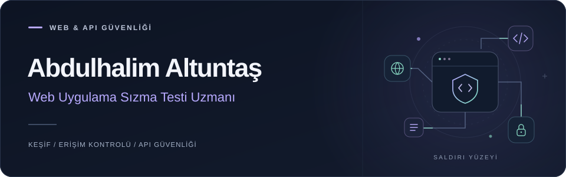
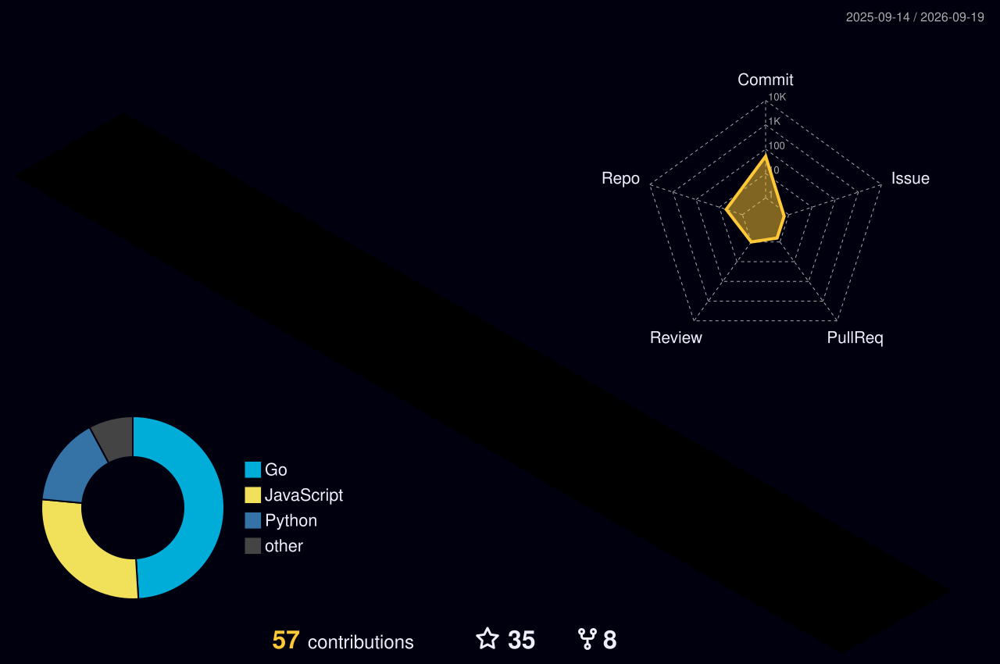

<!-- Artwork sources: assets/src/. Portable font outlines: scripts/outline_svg.py. -->

  <a href="README.md">ENGLISH</a> &nbsp; / &nbsp; <strong>TÜRKÇE</strong>

  <picture>
    <source media="(max-width: 600px)" srcset="assets/hero-mobile.tr.svg">
    
  </picture>

  
  
  

<h3 align="center">Uygulamaların zayıf noktalarını keşfeder, güvenli hâle gelmelerine katkı sağlarım.</h3>

  Ben <strong>Abdulhalim</strong>, <strong>web ve API güvenliğine</strong> odaklanan bir web uygulama sızma testi uzmanıyım. Erişim kontrolü, kimlik doğrulama, enjeksiyon ve iş mantığı üzerine çalışıyorum. Saldırı yüzeyini haritalar, etkiyi doğrular ve testleri tekrarlanabilir kılan araçlar geliştiririm.

  <picture>
    <source media="(max-width: 600px)" srcset="assets/expertise-mobile.tr.svg">
    
  </picture>

<strong>Teknik odak alanlarımı incele</strong>

- **Erişim kontrolü** — yetkilendirme açıkları, IDOR / BOLA ve yetki sınırları.
- **Kimlik doğrulama** — giriş akışları, token işleme, JWT doğrulama ve oturum yönetimi.
- **Enjeksiyon** — SQL enjeksiyonu, XSS ve güvenilmeyen girdilerin işlenmesi.
- **SSRF** — sunucu tarafındaki istekler ve servisler arasındaki güven sınırları.
- **API ve iş mantığı** — REST / GraphQL, belgelenmemiş uç noktalar ve iş akışı suistimalleri.
- **Keşif ve otomasyon** — varlık keşfi, uç nokta haritalama ve Python / Bash araçları.

 

  <picture>
    <source media="(max-width: 600px)" srcset="assets/workflow-mobile.tr.svg">
    
  </picture>

  <picture>
    <source media="(max-width: 600px)" srcset="assets/terminal-mobile.tr.svg">
    
  </picture>

  <picture>
    <source media="(max-width: 600px)" srcset="assets/toolkit-mobile.tr.svg">
    
  </picture>

<strong>Tüm araç setini görüntüle</strong>

| Çalışma alanı | Araçlar ve teknolojiler |
| :--- | :--- |
| **Keşif** | Nmap, Amass, subfinder, httpx, katana, ffuf, gobuster, waybackurls, Shodan |
| **Web ve API testleri** | Burp Suite, OWASP ZAP, Nuclei, Postman, GraphQL, JWT, tarayıcı geliştirici araçları |
| **Hedefe yönelik testler** | sqlmap, XSStrike, Metasploit |
| **Parola güvenliği** | Hydra, Hashcat, John the Ripper |
| **Trafik ve ağ analizi** | Wireshark, tcpdump, mitmproxy, OpenVPN |
| **Betik ve uygulama geliştirme** | Python, JavaScript, Bash, Node.js, HTML, CSS, MySQL |
| **Çalışma ortamı** | Linux, Docker, Git, GitHub, VS Code |

 

<h3 align="center">GITHUB ÜZERİNDE</h3>

Kodlar, denemeler ve katkılar.

  <a href="https://github.com/abdulhalimaltuntas?tab=repositories"><strong>Projelerimi incele ↗</strong></a>
  &nbsp; · &nbsp;
  <a href="https://github.com/abdulhalimaltuntas?tab=overview">GitHub etkinliğim</a>

  

  <picture>
    <source media="(prefers-color-scheme: dark)" srcset="https://raw.githubusercontent.com/abdulhalimaltuntas/abdulhalimaltuntas/output/snake-dark.svg">
    
  </picture>

  <a href="mailto:altuntashalim123@gmail.com">
    <picture>
      <source media="(max-width: 600px)" srcset="assets/footer-mobile.tr.svg">
      
    </picture>
  </a>

  <a href="mailto:altuntashalim123@gmail.com"><strong>altuntashalim123@gmail.com</strong></a>
    
  Tüm güvenlik testleri, sahibi olduğum veya test etmek için yazılı yetki aldığım sistemlerde gerçekleştirilir.

